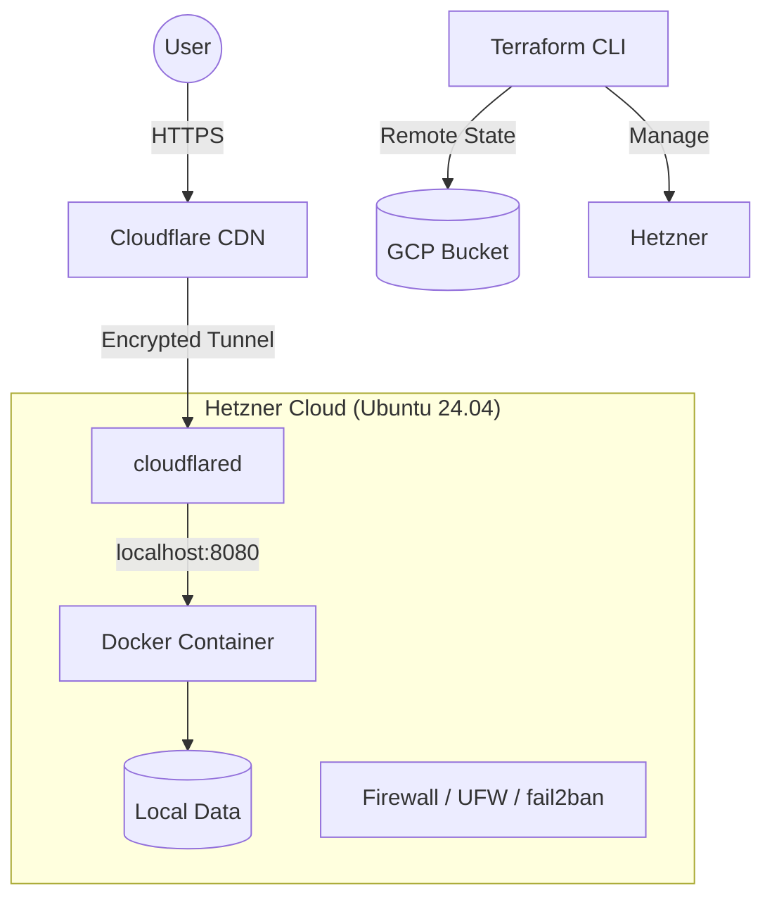

# 🚀 OpenClaw Infrastructure

[](https://www.terraform.io/)
[](https://www.hetzner.com/cloud)
[](https://cloud.google.com/)
[](https://www.cloudflare.com/)
[](https://n8n.io/)
[](https://qdrant.tech/)

Automated, production-ready infrastructure for **OpenClaw** hosted on Hetzner Cloud. Features secure access via Cloudflare Tunnels and a remote GCP state backend.

---

## 🏗️ Architecture



> [!NOTE]
> All incoming web traffic is routed through **Cloudflare Tunnel**. The server has NO public HTTP/S ports open to the internet.

---

## 📦 Infrastructure Stack

| Component | Description |
|-----------|-------------|
| **Compute** | Hetzner CX33 (4 vCPU, 8 GB RAM) |
| **Networking** | Private VPC (`10.0.0.0/16`) with internal subnets |
| **Security** | SSH on port 2222, Fail2Ban, root access disabled |
| **Connectivity** | Cloudflare Tunnel (no public ingress) |
| **State** | GCS bucket with versioning for Terraform state |

---

## 🛠️ Prerequisites

Before you begin, ensure you have:

- [ ] **Terraform** >= 1.5 installed
- [ ] **gcloud CLI** authenticated (`gcloud auth login`)
- [ ] **Hetzner Cloud** account + API token
- [ ] **Cloudflare** account with DNS zone managed
- [ ] **SSH Key** available at `~/.ssh/id_ed25519`

---

## 🚀 Getting Started

### 1️⃣ Initialize remote state
Create a GCS bucket to store your infrastructure state securely:
```bash
gsutil mb -p your-project-id -l EU gs://openclaw-tfstate
gsutil versioning set on gs://openclaw-tfstate
```

### 2️⃣ Configure environment
Clone the example configuration and fill in your details:
```bash
cp terraform.tfvars.example terraform.tfvars
# Open terraform.tfvars and provide your keys/IDs
```

### 3️⃣ Deploy infrastructure
```bash
terraform init
terraform plan
terraform apply
```

---

## 🛡️ Security Model

Designed with a **Zero Trust** mindset:

- 🔒 **Zero Public Ingress**: No ports 80/443 exposed. All web traffic flows through the tunnel.
- 🔑 **Hardened SSH**:
  - Custom port `2222` to avoid scanners.
  - Root login **disabled**.
  - Password authentication **disabled** (SSH key only).
  - Restricted to whitelisted IPs via firewall.
- 🛡️ **Active Protection**: `fail2ban` automatically drops IPs after multiple failed attempts.
- 📁 **Secure State**: Infra state is versioned and encrypted in GCS.

---

## 💰 Cost Breakdown (Monthly)

| Resource | Cost (Est.) |
|----------|-------------|
| Hetzner CX33 | **~€10.35** |
| Cloudflare Tunnel | **Free** |
| GCS State Storage | **Minimal** |
| **Total** | **~€10.35 / mo** |

---

## 📑 Module Overview

- `gcs-backend`: GCS bucket setup for Terraform.
- `network`: VPC and internal subnet configuration.
- `firewall`: Custom SSH and ICMP rules.
- `cloudflare`: Tunnel and DNS record management.
- `server`: CX22 instance with `cloud-init` bootstrapping.

---

## 🔌 Ecosystem & Integrations

Enhance your OpenClaw setup with these optional components:

- **n8n**: Dedicated nodes are available for automating OpenClaw workflows.
- **Qdrant**: Can be integrated as a high-performance vector database for your knowledge base.

---

## 🚦 Verification Commands

```bash
# SSH Access (Non-root, port 2222)
ssh -p 2222 deploy@$(terraform output -raw server_ipv4)

# Service Health
sudo systemctl status cloudflared
docker ps

# External Health Check
curl -I https://your-domain.com
```
